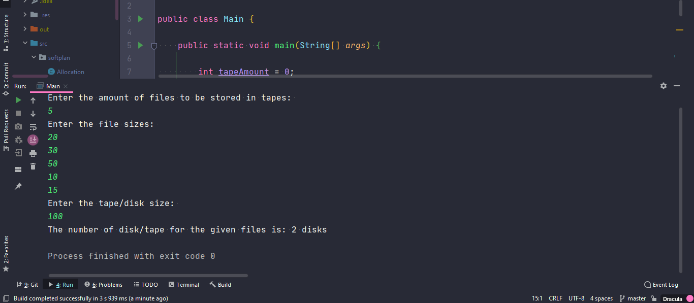

# <div align="center">SOFTPLAN</div>
### <div align="center">Exercício 1 – Algoritmos</div>


Uma empresa está montando um novo cluster de storage com discos antigos. Esse novo cluster foi entregue e o pessoal da infra passou as seguintes limitações: 
-  É proibido colocar mais de  2 arquivos no mesmo disco.
-  Um arquivo não podem ser dividido e colocado em multiplos discos.

O Objetivo do seu algoritmo é retornar a quantidade minima de discos necessária para armazenar os arquivos informados.  É garantido que todos os discos tem o mesmo tamanho e que eles conseguem armazenar o maior arquivo. Você receberá como entrada, o tamanho de cada disco, e o tamanho de cada arquivo que deverá ser armazenado.
Exemplo: 
- Entrada: Tamanho Disco: 100; Arquivos: 20, 30, 50, 10, 15
- Saída: 2 (discos)

Use a linguagem umas das seguintes linguagens: Java, GO, C# ou Python:

#### Protótipo

```java
package softplan;

public interface Batch {
    int[] getFileSizes();
    int getTapeSize();
}

public class Ex1 {
    public static int getMinimumTapeCount(final Batch batch) {
        return 0;
    }
}
```

### Informações:


```java
// A estrutura de pacotes foi feita da seguinte forma:
package softplan;

// Conforme o modelo do Protótipo acima
```

```
IDE: IntelliJ IDEA
JDK: versão 11
Tipo de Aplicação: Console application
```

### Instruções:
* Entre com o número de arquivos que você deseja armazenar.
* Entre com o tamanho de cada arquivo conforme o número de arquivos.
* Entre com o tamanho do disco/fita (aqui usado fita apenas para manter o padrão do protótipo).

##### O resultado será semelhante a imagem abaixo:
<br />
<div align="center"></div>

    *Obs.: Os exercícios foram feitos em inglês para manter a consistência conforme o exercício 1.

<br />

    **Outras Observações:
    Conforme o valor dado da Saída: 2 (discos), o algorítmo implementado foi o conforme o modelo a seguir:

```java
public class YourClassNameHere {
    public static void main(String[] args) {
      
      int diskSize = 100;
      int newDisk = diskSize;
      int diskNum = 0;
      int[] fileList = {20, 30, 50, 10, 15};
      
      for (int index = 0; index < fileList.length; index++) {
        diskSize = diskSize - fileList[index];
        
          if (diskSize <= 0) {
                      
            diskNum = diskNum + 1;
            
            diskSize = newDisk;
            
          } 
      }
      if (diskSize < newDisk) {
        diskNum = diskNum + 1;
        System.out.println("Number of disks for the given files: " + diskNum);
      } else {
        System.out.println("Number of disks for the given files: " + diskNum);
      }

    }
}
```
> Resultado: 2 discos

    **Para atender a limitação "É proibido colocar mais de  2 arquivos no mesmo disco.", o algorítmo indicado seria conforme o modelo a seguir:

```java
public class Main {
    public static void main(String[] args) {
      
      int diskSize = 100;
      int newDisk = diskSize;
      int diskNum = 0;
      int[] fileList = {20, 30, 50, 10, 15};
      
      for (int index = 0; index < fileList.length; index++) {
        diskSize = diskSize - fileList[index];
        // Add 1 to the index
        int fileAmount = index + 1;        
          // Change the declaration
          if (fileAmount % 2 == 0) {
                      
            diskNum = diskNum + 1;
            
            diskSize = newDisk;
            
          } 
      }
      if (diskSize < newDisk) {
        diskNum = diskNum + 1;
        System.out.println("Number of disks for the given files: " + diskNum);
      } else {
        System.out.println("Number of disks for the given files: " + diskNum);
      }

    }
}
```
> Resultado: 3 discos