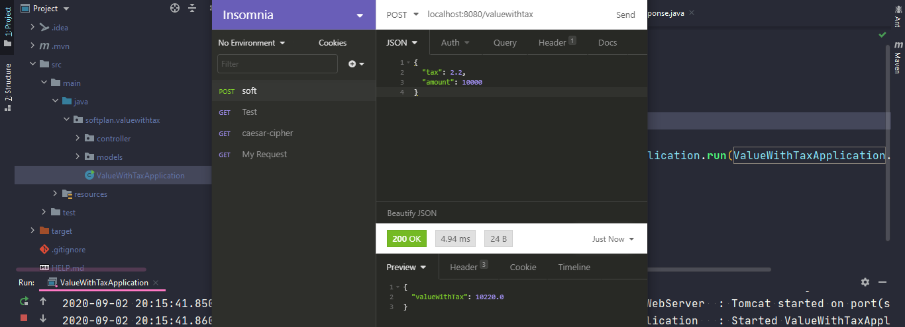

# <div align="center">SOFTPLAN</div>
### <div align="center">Exercício 2 – Expondo API</div>


Você deverá criar uma API's com um endpoint (em sua linguagem preferida):


```java
Path relativo "/valueWithTaxes" 
Verbo POST
Exemplo de payload: {
	tax: 2.2
	amount: 10000
}
```
### Informações:


```java
// A estrutura de pacotes foi feita da seguinte forma:
package softplan;

// Conforme o modelo do Exercício 1 – Algoritmos
```

```
IDE: IntelliJ IDEA
API Client: Insomnia
JDK: versão 11
Framework: Spring Boot
Tipo de Aplicação: API (post request)
```

### Instruções:
* Entre com os valores para "tax" e "amount" em formato JSON.
*Crie uma POST request com o endereço:
> localhost:8080/valuewithtax

ou no Heroku:
>> https://value-with-tax.herokuapp.com/valuewithtax

##### O resultado será semelhante a imagem abaixo:
<br />
<div align="center"></div>


    *Obs.: Os exercícios foram feitos em inglês para manter a consistência conforme o exercício 1.
