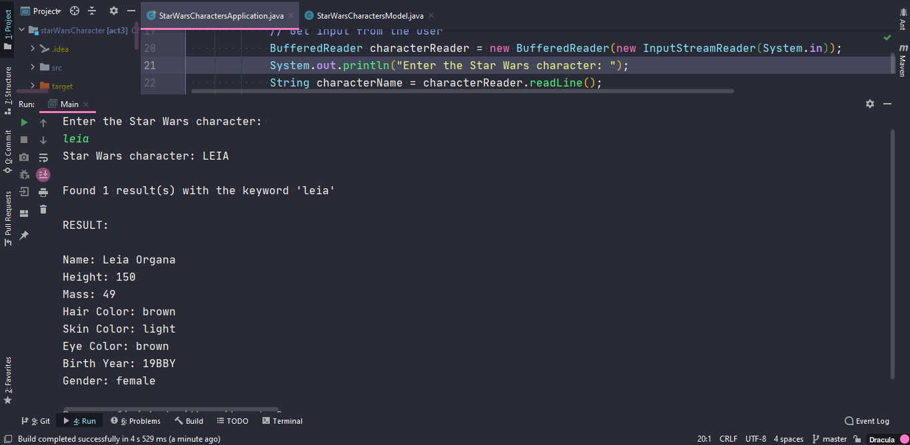

# <div align="center">SOFTPLAN</div>
### <div align="center">Exercício 3 – Consumindo API</div>

    Crie um programa console em sua linguagem preferida para consumir o endpoint para recuperar informações sobre os personagens do start wars:

> https://swapi.dev/api/people/?search=anakin

    O 1º  Argumento do programa deverá ser o nome do personagem a ser pesquisado.

    O resultado deverá ser as informações básicas  do personagem, formatadas, conforme json retornado.

### Informações:
    
```java
// A estrutura de pacotes foi feita da seguinte forma:
package softplan;

// Conforme o modelo do Exercício 1 – Algoritmos
```
    IDE: IntelliJ IDEA
    JDK: versão 11
    Tipo de Aplicação: Console application


### Instruções:
* Digite um nome de um personagens do filme Star Wars.

##### O resultado será semelhante a imagem abaixo:
<br />
<div align="center"></div>